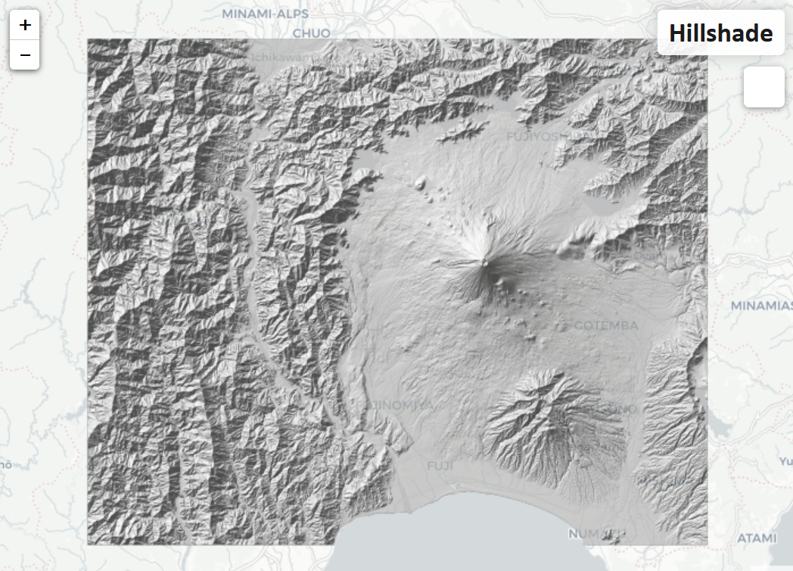

# DEM Raster File Converter
## Transforming Open Source GIS Data

[](https://danielhoshizaki.com/DEM-hillshade/)
Click the image to preview a demo site.

### Purpose
This projects provides a convenient way to convert open source GIS data provided by the [Geospatial Information Authority of Japan](https://fgd.gsi.go.jp/download/menu.php). The primary function of this project is to provide a method for automatically converting the raw data source (a zipped XML file) into GIS software and web compatible formats. The final output is a WTMS folder that contains tiled hill shade PNG files.

### Use
Download any DEM file over Japan from [this site](https://fgd.gsi.go.jp/download/mapGis.php?tab=dem). Save the zipped folder in the `./data/raw` directory. Run the following command:

```
make all
```

After a while you will see a newly created directory `./data/WTMS`. Double click on the html file `./data/WTMS/leaflet.html` and you will be able to visualize the DEM data from the zipped folders downloaded from gsi.go.jp.
